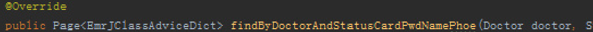
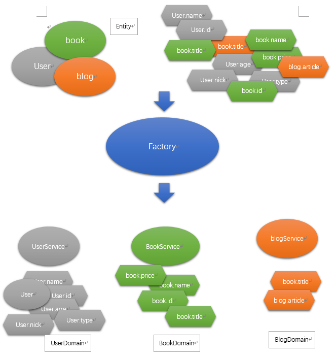
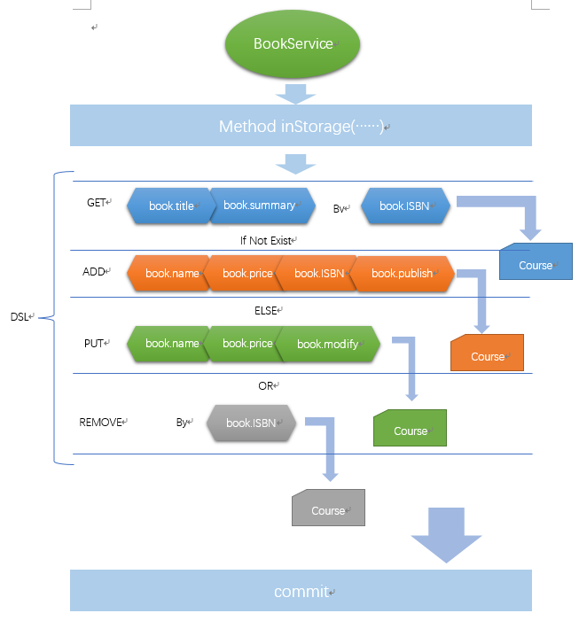
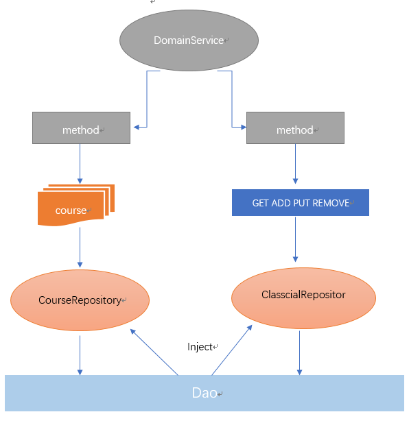

CloverFramework
===============

Summary
-------

CloverFramework是一个领域驱动设计框架（DDD），有关领域驱动设计的概念在此：<https://en.wikipedia.org/wiki/Domain-driven_design>。为了实现领域驱动模型的系统架构，将相关的概念、组件定义然后固化，我根据实际建模和业务实现的需求，制作了一个基于DDD的业务核心，并且持续的扩充特性和接口功能。

### Change

#### Can you still put up with this?

还在使用冗长的dao接口和service接口吗？

你是否还在重复着做这样的事情？

方法名如诗和远方，怎么会这样?背后隐藏了太多的无奈和烦恼。

#### Problem

不管是传统的三层架构还是领域驱动模型，都无法回避这个问题，因为业务形式是变化的，而接口是固化的，为了同时满足两者，只能牵一发动全身，业务的复杂度提高以后，就出现了上面的尴尬局面。

传统的三层架构包括DAO层、service层、view层，而《领域驱动设计-软件核心复杂性应对之道》一书中将领域驱动架构定义为四层：仓储、领域、应用、UI。在这当中，领域层最为复杂，又细化为工厂、领域服务、翻译器、值对象等一些列组件，目的就是解决三层架构无法应对诸如**业务多边形的复杂度问题**。

大部分的DDD架构都被设计成如下图：

如果尝试按照上述的组件划分建模、设计架构，通常没有（甚少）带来业务过程实现的简化，也没有带来其他方面的提升，更不用说应对业务的复杂，这种DDD实现方式的缺点：

-   过程复杂，无法明确组件职责，后期问题明显增多。

-   值对象和不变性的强调使用代价太高。

-   应用聚合并不能应对复杂性，反而提高了系统复杂度。所谓的聚合，更是为了迎合一些ORM框架多表查询的实体关系，但是如果这么做，便是失去领域驱动而回到了数据模型驱动。

### What’s change

可以尝试另一种方式，我们应当保留的内容如下：

-   应用层

-   领域层（实体、工厂、服务）

-   仓储层

-   引入新的模式：依赖倒置（六边形架构）、DSL（Domain-specific
    language领域专用语言）

这就构成了一个简化的DDD模式：

上图中，领域服务service、领域实体entity、factory这三大组件构成了运转的核心，其工作流程很简单：

Service通过DSL组织业务所需要的entity字段，而factory识别service和entity的关系后，只有合法的domainentity才可以被service使用，转化为一种数据结构course，course封装了一个业务过程的一个或多个步骤，这些步骤以一种通用的方式提交至仓储，仓储则是一个接口层，它限定了跟数据层的交互方式：courseRepository通过course交互，classcialRepository则是经典三层方式。

最关键的一点是，业务需求的变化已经被封装在course内，Dao无须再定义一个方法提供业务支持，如：getBookByIdAndTitle，因为它已经写入了course中，我们的业务层也无需针Dao层进行注入，需要清晰明了将方法和作用对应即可，如inStorage，delStorage，updateType等等。

下面的图展示了领域服务、实体、工厂的关系：

下面的图展示了领域内服务的实现方式：

下面的图展示了course到仓储的关系：

### What does CloverFramework do

-   将简化的DDD模式固化为一个核心，并提供针对实体的DSL来组织业务需求语言。

-   实现领域内业务过程可编排、可重用、可重组。

-   根据领域树实现对过程和领域的关联和过滤。

-   依赖倒置，提供API与数据层和UI对接。

How to uesd
-----------

### CreateDomainService
