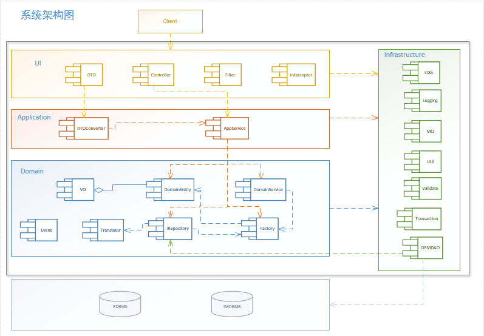
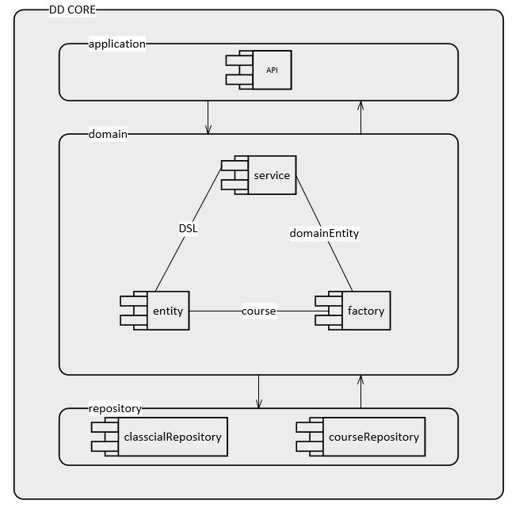
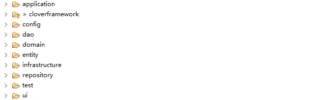

CloverFramework
===============

Summary
-------

CloverFramework是一个领域驱动设计框架（DDD），有关领域驱动设计的概念在此：<https://en.wikipedia.org/wiki/Domain-driven_design>。为了实现领域驱动模型的系统架构，将相关的概念、组件定义然后固化，我根据实际建模和业务实现的需求，制作了一个基于DDD的业务核心，并且持续的扩充特性和接口功能。

### Change

传统的三层架构包括DAO层、service层、view层，而《领域驱动设计-软件核心复杂性应对之道》一书中将领域驱动架构定义为四层：仓储、领域、应用、UI。在这当中，领域层最为复杂，又细化为工厂、领域服务、翻译器、值对象等一些列组件，目的就是解决三层架构无法应对诸如**业务多边形的复杂度问题**。然而，如此细致的划分让人难以相信这仅仅只一个设计学说，却没有相关的设计规范。或许还有一本书可以参考《实现领域驱动设计》，但是我认为还是没有根本上解决问题。

大部分的DDD架构都被设计成如下图：

如果/尝试按照上述的组件划分建模、设计架构，往往不仅没有（甚少）带来实现过程的简化，也没有带来其他方面的提升，跟不用说应对业务的复杂，这种DDD实现方式的缺点：

-   过程复杂，无法明确组件职责，后期问题明显增多。

-   值对象和不变性的强调使用代价太高。

-   应用聚合并不能应对复杂性，反而提高了系统复杂度。所谓的聚合，更是为了迎合一些ORM框架多表查询的实体关系，但是如果这么做，便是去领域驱动而回到了数据模型驱动。

### What’s change

DDD的一些概念是非常值得借鉴的，而一些概念则不适合。经过权衡后定义的内容如下：

-   应用层

-   领域层（实体、工厂、服务）

-   仓储层

-   引入新的模式：依赖倒置（六边形架构）、DSL（Domain-specific
    language领域专用语言）

这就构成了一个简化的DDD模式：

### What does CloverFramework do

-   将简化的DDD模式固化为一个DD核心，并提供针对实体的DSL来组织业务需求语言。

-   实现领域内业务过程可编排、可重用、可重组。

-   根据领域树实现对过程和领域的关联和过滤。

-   依赖倒置，提供API与数据层和UI对接。

How to uesd
-----------

### Project structure

导入cloverframework，然后只需要确保您的项目如下目录和内容即可：

目前下方内容中强调的是必需的，

Application:应用层的内容

Config:框架的配置

**Dao:数据层**

**Domain:领域层，您的service在此**

**Entity:实体**

Infrastructure:基础设施，如log、validate、util、mq等

Repository:传统三层类型的service-dao接口

Test:测试内容

Ui:用户交互

### CreateDomainService

\`\`\`literal = course==null?literal:course.literal;

literal_te = course==null?literal_te:course.literal_te;

domainService = course==null?domainService:course.domainService;

proxy = course==null?proxy:course.proxy;\`\`\`
