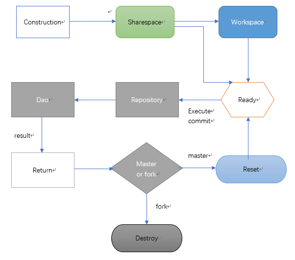

Summary
=======

CloverFramework是一个领域驱动DSL框架（DDD-DSL），有关领域驱动设计的概念参见：<https://en.wikipedia.org/wiki/Domain-driven_design>。

Change
------

### Can you still put up with this?

在经典三层四层框架项目中，在service中使用冗长的dao接口，有着大量重复和冗余：

FinadByNameAndStatusCard

FinadByPhoneAndRoom

GetStatusAndDoctorBy……

……

-   需要管理大量的接口描述\\注释

-   需要管理大量的接口实现

-   需要维护接口跟调用者之间的关系

-   与业务的实现思维逆行

-   有限的接口与无限种业务需求是根本的冲突

-   接口的复用大颗粒度

### Problem

不管是传统的三层架构还是领域驱动模型，都无法回避这个问题，因为业务形式是变化的，而接口是固化的，为了同时满足两者，牵一发动全身，业务的复杂度提高以后，接口在某种程度上成为一种负担，一种局限，java8的默认接口正是对此问题的一种缓解。

传统的三层架构包括DAO层、service层、view层，而《领域驱动设计-软件核心复杂性应对之道》一书中将领域驱动架构定义为四层：仓储、领域、应用、UI。在这当中，领域层最为复杂，又细化为工厂、领域服务、聚合、值对象等一系列组件，目的是为解决三层架构无法应对诸如业务多边形的复杂度问题。

DDD架构大致如下图：

针对上述的领域层，通过传统的bean方式组合实现，未必会带来实现的简化，更不用说应对业务的复杂，这种DDD实现方式的不足：

-   过程复杂，一些组件职责不明确，后期问题明显增多，纵向开发模式下不如经典三层。其本质仍是三层，形式大于作用。

-   接口规约会产生沟通和确认成本，灵活性欠缺，后期维护代价高。通过java8推出的函数接口可见接口的问题确实存在。

-   领域内部聚合并不能应对复杂性，反而提高了系统复杂度，因为聚合代表的并不是业务的变化，它仍旧是一种抽象。在这种模式下，更是为了迎合一些ORM框架多表查询的实体关系，如果把控不当，便是失去领域驱动而回到了数据模型驱动。

What’s change
-------------

永远不要拘泥于A方案，可以尝试另一种方式，我们应当保留的内容如下：

-   应用层

-   领域层（实体、工厂、服务）

-   仓储层

-   引入新的模式：依赖倒置、DSL（Domain-specific language领域专用语言）

构成一个简化的DDD模式：

上图中，领域服务service、领域实体entity、factory这三大组件构成了运转的核心，其工作流程很简单：

Service通过DSL组织业务所需要的entity字段，而factory识别service和entity的关系后，只有合法的domainentity才可以被service匹配，然后转化为一种数据结构course，course封装了业务过程的一个或多个步骤，这些步骤以一种通用的方式提交至仓储，仓储则是一个接口层，它限定了跟数据层的交互方式：courseRepository通过course交互，classcialRepository则是经典三层方式。

最关键的一点是，业务需求的变化已经被封装在course内，Dao无须再根据service定义一个方法提供业务支持，如：getBookByIdOrTitle，因为它已经写入了course中，我们的业务层也无需针Dao层进行注入，只需要将方法和作用对应即可，如inStorage，delStorage，updateType等等。

下面的图展示了领域服务、实体、工厂的关系：

下面的图展示了领域内服务的实现方式：

下面的图展示了course到仓储的关系：

What does CloverFramework do
----------------------------

-   将简化的DDD模式固化为一个核心，并提供DSL来组织业务需求语言，其所见即是业务逻辑本身，而非接口形成的断面。

-   实现领域内业务过程可编排、可重用、可重组。

-   根据领域树实现对过程和领域的关联和过滤。

-   依赖倒置，提供API与数据层和UI对接。

所有的这些，归纳为即是一个通用领域DSL框架所做的事情。以前我们为了解耦，将业务和Dao分离，接口是有副作用的，在进行横向开发的时候，修订和沟通成本是不断增加的，如果我们尽可能将这些工作（耦合）交给程序，而不是接口的设计，从而更专注于业务和数据访问优化，也许能够开辟更多的空间。

如果初始阶段有一个合理的领域树建模，将会更大的发挥其优势。

从另一点来看，类似的DSL还有spring data jpa
queryDSL，前者跟JPA紧密结合，属于DAO层，后者（CloverFramework）属于业务层，跟DAO无关。CloverFramework最初的设想是为了摆脱DAO接口的束缚，获得更高内聚的领域核心，而业务处理过程的本身是没有改变的，换而言之，原先的工作没变，只不过让程序更多的完成它力所能及的事情。

Use
===

Let’s create first course
-------------------------

首先我们来一个万金油用例，例如用户资料管理。我们需要准备一些组件。

实体类：User，除了给他标记了一个Domain的注解之外，它跟平常没有什么不同，对于DDD而言属于贫血模型。

\@Domain("User")

**public class** User {

**private int** id;

**private** String username;

**private** String nick;

**private** String password;

**private** String email;

**private** String phone;

**private** String question;

**private** String answer;

**private** Date login;

**private** Date logout;

**private int** visit;

**private** String ip;

}

同时创建对应的枚举类型，虽然枚举更符合我们的习惯，但并不是必需的。我们可以利用EntityGenerator自动生成字典，<https://github.com/LoongYou/EntityGenerator>，目前这个工具并未集成到框架中：

**public enum** User_d{

*User //字典的第一个元素必须是对应的类型名称*

,*id*

,*username*

,*nick*

,*password*

,*email*

,*phoner*

,*question*

,*answer*

,*login*

,*logout*

,*visit*

,*ip*

}

这是服务类：UserService，同样的，除了给它标记一个Domain的注解以及实现DomainService接口之外，跟平常没有什么不同。

\@Domain("User")

**public class** UserService **implements** DomainService{

}

接下来实现业务的第一步，在service中创建一个方法，例如创建一个login的方法，在方法中实现查询和校验，在这个演示中，我们只需要实现查询过程即可，例如首先查询用户的用户名和密码：

**public Result** login(String username) {//username = jackson

*CourseProxy* proxy = **new** *CourseProxy*(**this**);

proxy.START().get(User_d.*id*).by(User_d.*password*).eq(username).END();

System.*out*.println(proxy.getCurrCourse());

//do something

**return** result;

}

我们在login方法中创建一个CourseProxy，通过它可以更方便的操作course，然后START()开启一条DSL任务语句，END()为结束语句，执行login，输出刚刚创建的Course：

Root id:1221555852

Get User.id , User.password by User.username eq values:[jackson]

这相当于你在原来的Dao层编写了一道方法如：getIdAndPasswordByUsername(),但是现在你已经无需这么做了，对于在service中调用的dao接口方法，你只需要将它们换成你具体的描述即可，并且你可以用更加细化的粒度来定制需求。开始解放你的接口吧。

Submit Course to repository and execute course
----------------------------------------------

刚才我们已经创建了一条DSL语句，接下来只需将它交给仓储处理，这里，创建一个用于User领域的通用Dao：

**public class** GeneralDao **implements** ICourseMode\<User\>{

\@Override

**public** User get(DataSwap\<User\> swaper) {

String id = swaper.transfer().id();

System.*out*.println("Dao got the course:"+id);

**return new** User();

}

\@Override

**public int** add(DataSwap\<User\> swaper) {

// **TODO** Auto-generated method stub

**return** 0;

}

\@Override

**public int** put(DataSwap\<User\> swaper) {

// **TODO** Auto-generated method stub

**return** 0;

}

\@Override

**public int** remove(DataSwap\<User\> swaper) {

// **TODO** Auto-generated method stub

**return** 0;

} }

你可以看到，这个Dao实现于ICourseMode接口，只需要实现GET\\ADD\\PUT\\REMOVE四种通用操作即可，仓储会根据course的类型调用对应的接口方法，无须再操心的方法名了。至于其中调用的方法和组件，后面会介绍。

现在为了让course和repository进行类型检查，在刚刚的login方法中，我们需要作对应的操作：

**public Result** login(String username) {

CourseProxy\<User\> proxy = **new** CourseProxy\<User\>(**this**);

proxy.setRepository(**new** CourseRepository\<User\>() {{setMode(**new**
GeneralDao());}});

proxy.START().get(User_d.*id*).by(User_d.*password*).eq(username).END();

User u = proxy.executeOne();

System.*out*.println(proxy.getCurrCourse());

System.*out*.println(u);

//do something

**return** Result;

}

只需要给CourseProxy加上User的泛型，并且设置所使用的仓储接口即可，在实际中可以将这些工作交给IOC框架来做。

下面展示了仓储调用Dao执行DSL的结果：

Dao got the course:1523990044078

root id:1523990044078

get User.id

by User.password eq values:[jackson]

com.entity.User\@7c53a9eb

No dictionary
-------------

之前说到，不需要实体类的字典也可以实现同样的DSL：

proxy.START().get(*user*.getId(),*user*.getPassword()).by(*user*.getUsername()).eq(username).END();

所需要的只是通过工厂得到一个User类型的样板*Staple，*然后调用样板user的getter即可*：*

**private static final** User *user* =
EntityFactory.*getStaple*(User.**class**);

在实际中，如果没有通过容器加载工厂，那么需要先得到工厂实例：

**private static final** User *user* =
*EntityFactory.getInstance().getStaple(User.class)*;

这种方式无需字典，采用哪一种方式取决于你。

Data structure
--------------

目前，course支持两种结构内容检出方式：

proxy.getCurrCourse().toString()

proxy.getCurrCourse().getJsonString()

**toString：**用一种简明的方式输出course的摘要信息

Get User.id , User.password by User.username

**JsonString：**具体的节点和属性，course中的数据结构跟json格式不尽相同，这些属性可以通过course的getter得到，在Dao层处理的时候可以通过Warpper轻松获取：

{

"type" : "get", -----------------------------------------------------\>节点类型

"fields" : [ "User.id", "User.password" ], --------------------\>操作字段

"types" : [ "User" ],
----------------------------------------------\>字段实体类型

"optype" : null, ---------------------------------------------------\>操作类型

"values" : null, ---------------------------------------------------\>输入值

"son" : null, -------------------------------------------------------\>子节点

"next" : {-----------------------------------------------------------\>后节点

"type" : "by",

"fields" : [ "User.username" ],

"types" : [ "User" ],

"optype" : "eq",

"values" : [ "jackson" ],

"son" : null,

"next" : null

}

}

Life of course
--------------

Course作为DSL的核心组件以及连接service和repository中间件，是具有状态的，course的大部分管理工作都由CourseProxy或者Action来完成，course分为模板和副本，分别用START和FORK产生，这两种course的区别是：

-   模板是共享的，不可销毁的。

-   副本是模板的扩展，消费后需要销毁。

下面展示了course的生命周期：

VO parameter and VO result
--------------------------

以往我们的领域聚合以及传递业务的参数，通常会用到值对象VO，VO的划分往往饱受争议，如果业务多变，VO会有很多，实现的粒度不易于控制，其拷贝和表达会造成不必要的浪费和开销。而使用course的值类型参数和值类型结果就不存在这个问题，因为这些对象所谓的划分通过DSL来描述可以有无限中可能，并且可以动态的改变，这种原始的优势在经典三层或四层架构模式中被舍弃。

参数和结果以构造对象的方式创建，即是对传入的值的拷贝，具有基本的不变性。

### set parameter

设置参数值有多种途径，而这些途径的规则可以由你来定，默认的规则建议如下：

-   每个字段对应每个参数：

START("addUser").add(User_d.*username*,User_d.*password*,User_d.*email*)

.setValues("jackson","888888","168\@dd.com").END();

相当于：

add User.username,User.password,User.email values:[[jackson, 888888,
168\@dd.com]//values(?,?,?)](mailto:jackson,%20888888,%20168@dd.com%5D//values(?,?,?))-\>jackson,
888888, 168\@dd.com

-   多个字段对应同一个参数，前提字段类型一致：

START("setUser").put(User_d.*username*,User_d.*nick*,User_d.*email*)

.setValues("jackson").END();

相当于：

put User.username,User.nick,User.email values:[jackson] //values(?,?,?) ,? =
jackson

-   字段跟领域实体\\值对象mapping：

START("addUser1").add(User_d.*username*,User_d.*password*,User_d.*email*)

.setValues(\$(user)).END();

相当于：

add User.username,User.password,User.email values:[by
[com.entity.User\@439f5b3d]//](com.entity.User@439f5b3d%5D//)values(user.username,user.password,user.email)

-   带条件的字段和值：

START("getUser").get(User_d.*username*,User_d.*password*,User_d.*email*)

.by(User_d.*username*).eq("jackson").END();

相当于：

get User.username,User.password,User.email

by User.username eq values:[jackson]//where User.username = {?} ,? = jackson

-   带条件的字段和字段：

START("getUser1").get(User_d.*username*,User_d.*password*,User_d.*email*)

.by(User_d.*username*).eq(\$(Contact_D.*realName*)).END();

相当于：

get User.username,User.password,User.email

by User.username eq values:[by Contact.realName]//where User.username =
Contect.realName

而对于基本类型的参数值，可以使用更直接的方式：

START("getUser2").get(User_d.*username*,User_d.*password*,User_d.*email*)

.by(User_d.*type*).gt().value.setInt(3).END();

通过这种方式可以减少装箱和拆箱的开销，相当于：

get User.username,User.password,User.email

by User.type gt values:[3]] //where User.type \> 3

### Data-Swap Interface 

通常情况下，Dao与仓储的交互通过DataSwap接口来完成，该接口的方法如下：

CourseWrapper transfer();

Iterator\<CourseWrapper\> getCourseIterator();

**void** setResult(DataSet\<T\> data);

**void** setResult(List\<T\> list, List\<Object\> objectList, Map\<String,
Object\> map, Object value);

**void** setResult(CourseResult\<T\> result);

需要获取DSL的信息，如ID，类型等，使用transfer()，如果翻译DSL，则可以通过getCourseIterator()来迭代course节点。

CourseWrapper是course的包装器，这样Dao不可以直接访问course，而是通过包装器操作，你可以得到相关的信息和内容：

String id();

String type();

String opType();

CourseWrapper previous();

CourseWrapper next();

CourseWrapper parent();

List\<CourseWrapper\> sons();

List\<String\> fields();

Set\<String\> types();

List\<Object\> *entities*();

CourseValues value();

String json();

当Dao完成查询返回结果，结果的返回形式有两种，一种是DAO接口直接返回对象或数值，另一种是result对象，如上述的setResult方法，将结果内容封装在result对象中，那么service就可以从对应的course中获取result对象。CourseResult接口中的方法：

List\<T\> getList();

List\<Object\> getObjectList();

Map\<String, Object\> getMap();

**byte** getByte();

**short** getShort();

**int** getInt();

**float** getFloat();

**long** getLong();

**double** getDouble();

**boolean** getBoolean();

String getString();

### Return result

如何返回结果，第一种方式是直接返回，如果要返回带有状态的对象建议用这种方式，如持久化对象，游离态等，因为无须创建result，对象不会被其持有。

\@Override

**public** User get(DataSwap\<User\> swaper) {

String id = swaper.transfer().id();

System.*out*.println("Dao got the course:"+id);

//do something

**return new** User();//return object

}

另一种方式是返回result，你需要将查询结果放入result然后返回：

//do something

swaper.setResult(*list*, *objectList*, *map*, *value*);

在service中获取result：

List\<User\> list = getCourse("getUser").getResult().getList();

DataSet是一个返回类型接口，限定了查询数据转换为result数据结构必需的方法支持，你可以自行实现该接口按照自己的规则，然后用于构建result即可，该接口的方法如下：

/\*\*返回领域类型List\*/

List\<T\> toList();

/\*\*返回对象类型List\*/

List\<Object\> toObjectList();

/\*\*返回一个对象类型map\*/

Map\<String, Object\> toMap();

/\*\*返回一个值\*/

Object value();

在dao中返回result：

DateSet ds = new DataSetter();

swaper.setResult(ds);

Do more
=======

快速了解了之前的介绍后，我们知道course是一个工作在service中的DSL核心，现在可以对其进一步的发掘，做更多的事情了。

Course Cache
------------

例如创建多条DSL组建业务过程，这里有一个用户注册的简单用例，先检查用户名，然后注册用户，最后再次检查用户名：

**public Result** register(User user) {

CourseProxy\<User\> proxy = **new** CourseProxy\<User\>(**this**);

proxy.setRepository(**new** CourseRepository\<User\>() {{setMode(**new**
GeneralDao());}});

proxy.START("checkName").get(User_d.*id*,User_d.*password*).by(User_d.*username*).eq(user.getUsername()).END();

//"checkName"已被缓存

Course course = proxy.getCourse("checkName");

//The currentCourse is "checkName"

System.*out*.println("currentCourse："+proxy.getCurrCourse().getId());

**if**(proxy.executeOne(course)!=**null**)//return null

**return** Result;

**else** {

proxy.START("addUser").add(User_d.*username*,User_d.*password*,User_d.*email*)

.setValues(user.getUsername(),user.getPassword(),user.getEmail()).execute();

//The currentCourse is "addUser"

System.*out*.println("currentCourse："+proxy.getCurrCourse().getId());

}

proxy.executeOne(proxy.START("checkName"));

//The currentCourse is "checkName"

System.*out*.println("currentCourse："+proxy.getCurrCourse().getId());

//do something

**return** result;

}

使用CourseProxy的START(“id”)不仅可以创建一个course，该course会被缓存，再次使用START(“id”)可以调出缓存的course，并且再次对该course所做的节点修改都是无效的。START(“arg”)如果匹配不到course，则会创建新的course。每次使用START(“id”)，都会将当前Course引用指向最后调取的course。上面的执行结果如下：

currentCourse：checkName

Dao got the course:checkName

Dao got the course:addUser

currentCourse：addUser

Dao got the course:checkName

currentCourse：checkName

ShareSpace
----------

共享区是用于存放START(“id”)产生的course的区域，共享区对于一个所属的泛型CourseProxy实例都是可见的，你可以将常用的course贮存以复用它们。若希望一个course被放入共享区，这个course必需执行END()或者execute()：

如这些周期性的统计操作，我们可以随时从共享区中调取并执行。

**public void** general() {

CourseProxy\<User\> proxy = **new** CourseProxy\<User\>(**this**) {{

setRepository(**new** CourseRepository\<User\>() {{setMode(**new**
GeneralDao());}});

START("types").get(User_d.*type*).groupBy(User_d.*type*).END();

START("count").get(*user*).count(User_d.*id*).END();

START("countById").get(*user*).count(User_d.*id*).by(User_d.*type*).eq(1).END();

}};

proxy.START("types").execute();

proxy.START("count").execute();

proxy.START("countById").execute();

}

如上面的实例，使用匿名类可以更加方便DSL的构造，看上去也更加简洁。这些领域内通用的DSL，将它们放在一起方便复用，例如作为接口常量，或者静态类常量，前提是你必须确定这些courose是普适的而非特例，通常如业务所需的基数、轮询、全集等，而非获取某个用户的信息。

使用sharespace的course是线程不同步的，通常情况下你应当使用常量或基本类型参数来构造存入其中的course和其中的value，而不是引用类型或有状态的值。

ActionDomain
------------

ActionDomain是真正能够提供领域级别的DSL的service。前面所使用的CourseProxy提供了面向用户的course操作和管理方法，该类只适合创建普适的course，因为是线程不安全的。

Action是线程安全的，它是CourseProxy的一个子类，为了最大程度的利用DSL构造需求，ActionDomain是一个实现了DomainService接口的Action，你的service只需要继承ActionDomain就可以当做一个Action来直接操作DSL。例如上面的注册DSL可以这样：

**public class** UserService **extends** ActionDomain\<User\>{

**public Result** register(User user) {

START("checkName").get(User_d.*id*,User_d.*password*).by(User_d.*username*).eq(user.getUsername()).END();

**if**(executeOne(getCourse("checkName"))!=**null**)

**return** result;

**else** {

START("addUser").add(User_d.*username*,User_d.*password*,User_d.*email*)

.setValues(user.getUsername(),user.getPassword(),user.getEmail()).execute();

}

executeOne(START("checkName"));

//do something

**return** result;

}

}

Action的sharespace跟CourseProxy的sharespace相同，都是共享使用的，不同的是Action具有一个线程独立的workspace。建议在服务程序中泛化Action或ActionDomain来创建业务过程而非使用CourseProxy，Action还提供了批量提交并执行业务过程的特性。原则上不建议方法中创建action对象，因为那样会消耗大量内存，而是让业务组件继承action并使用单例。例如：UserService
extends Action。

Workspace
---------

Workspace是Action特有的course贮存区，只有当你使用一个Action或AactionDomain的时候才能调取。Workspace类似于购物车，当你创建了数个Course，可以放入其中并一次性提交，它具有临时性，提交之后会被清空，也就是说course被消费了之后就不能再使用了，这种模式适用于方法中，因此你不必关心某个course的作用域或者对其生命周期进行管理。

如之前sharespace展示的代码，可以如此批量执行：

**public void** general() {

*startWork*();

START("types").get(User_d.*type*).groupBy(User_d.*type*).END();

START("count").get(count(User_d.*id*)).END();

START("countById").get(count(User_d.*id*)).by(User_d.*type*).eq(1).END();

System.*out*.println("WorkSize:"+*getWorkSize*());

System.*out*.println("WorkSpace:"+getWorkSpace());

push();

endWork();

System.*out*.println("WorkSize:"+*getWorkSize*());

System.*out*.println("WorkSpace:"+getWorkSpace()); }

Startwork()开启工作区，在此之后所通过START()产生的course都会被工作区记录，并且是可重复的，直到endwork()，在此之后就不会记录course到工作区并且销毁并清空工作区，因此在endwork()之前你可以选择push将这些course交给repository执行。只要endwork，就意味着这些course的生命周期结束。若希望一个course被放入共享区，这个course必需执行END()或者execute()。

上面的操作结果如下：

WorkSize:10

WorkSpace:[

root id:types

get User.type

groupBy User.type,

root id:count

get count User.id,

root id:countById

get count User.id

by User.type eq values:[1]]

WorkSize:10

WorkSpace:[]通常情况下我们没有必要在工作区中执行START(id)来调取sharespace的course，因为这些course是共享的，如果没有比配到course就会创建新的course，容易造成sharespace膨胀。针对每个service方法，最好使用它们的副本，这样就不会造成脏读或同步问题，如下面介绍的FORK。

Fork of your course
-------------------

正如你现在所使用的Github一样，Fork方法是用来创建course的副本的。很多时候，同一个领域内的操作都存在一些共同点，如共同的查询字段，或者条件等等，我们最好能够令其可以重复利用，而非每次都要重新构造DSL。FORK正是为此而生：

**public void** testFork() {

START("a").get(Demo_D.*f1*,Demo_D.*f2*).END();

FORK("a").get(Demo_D.*f3*,Demo_D.*f4*).END();

FORKM("a").get(Demo_D.*f5*,Demo_D.*f6*).by(Demo_D.*f7*,Demo_D.*f8*).END();

System.*out*.println(toString());

}

在上面的操作中，START产生的id为a的course是模板，FORK则是对a的一个副本，FORK也是一个副本并且会存入sharespace，而FORK则不会。缺省情况下，不会进行模板的复制，FORK如果没有匹配到模板course，则会创建一个新的course，这个跟START()是等效的。上面的执行结果如：

Root id:a

Get Demo.f1 , Demo.f2

Root id:a_FM_1522998949681

Get Demo.f5 , Demo.f6 by:

By Demo.f7 , Demo.f8

### FORK MODE

现在使用一个模板为：

START("a").get(Demo_D.*f1*,Demo_D.*f2*,Demo_D.*f3*,Demo_D.*f4*).END();

#### *U*

与模板对应的节点求并集并复制为副本，此模式等同于合并去重复：

FORKM("a").get(U,Demo_D.f5,Demo_D.f6,Demo_D.f7,Demo_D.f8,Demo_D.f1,Demo_D.f2).END();

RESULT:

Root id:a

Get Demo.f1 , Demo.f2 , Demo.f3 , Demo.f4

Root id:a_FM_1522999336315

Get Demo.f7 , Demo.f4 , Demo.f8 , Demo.f5 , Demo.f2 , Demo.f6 , Demo.f3 ,
Demo.f1

FORK

#### *I*

与模板对应的节点求交集并复制为副本，此模式等同于消除差异：

FORKM("a").get(I,Demo_D.f5,Demo_D.f6,Demo_D.f7,Demo_D.f8,Demo_D.f1,Demo_D.f2).END();

RESULT:

Root id:a

Get Demo.f1 , Demo.f2 , Demo.f3 , Demo.f4

Root id:a_FM_1522999886923

Get Demo.f2 , Demo.f1

#### *C*

与模板对应的节点求补集并复制为副本，此模式等同于保留差异：

FORKM("a").get(*C*,Demo_D.*f5*,Demo_D.*f6*,Demo_D.*f7*,Demo_D.*f8*,Demo_D.*f1*,Demo_D.*f2*).END();

RESULT：

Root id:a

Get Demo.f1 , Demo.f2 , Demo.f3 , Demo.f4

Root id:a_FM_1522999936093

Get Demo.f7 , Demo.f4 , Demo.f8 , Demo.f5 , Demo.f6 , Demo.f3

#### *CA*

与模板对应的节点求补集并复制为副本，此模式等同于保留模板差异：

Root id:a_FM_1523000118246

Get Demo.f4 , Demo.f3

#### *CB*

与模板对应的节点求补集并复制为副本，此模式等同于保留副本差异：

RESULT:

Root id:a_FM_1523000598793

Get Demo.f7 , Demo.f8 , Demo.f5 , Demo.f6

#### *M/ RM*

与模板对应的节点交叉并复制为副本：

RESULT:

Root id:a get:

Get Demo.f1 , Demo.f2 , Demo.f3 , Demo.f4

Course id:a_FM_1523000784459

Root Demo.f1 ,Demo.f5 ,Demo.f2 ,Demo.f6 ,Demo.f3 ,Demo.f7 ,Demo.f4 ,Demo.f8
,Demo.f1 ,Demo.f2

Course id:a_FM_1523001053223

Root Demo.f5 ,Demo.f1 ,Demo.f6 ,Demo.f2 ,Demo.f7 ,Demo.f3 ,Demo.f8 ,Demo.f4
,Demo.f1 ,Demo.f2

#### *MA/MB*

前置/后置混合：

FORKM("a").get(*MA*,Demo_D.*f5*,Demo_D.*f6*,Demo_D.*f7*).END();

FORKM("a").get(*MB*,Demo_D.*f5*,Demo_D.*f6*,Demo_D.*f7*).END();

RESULT:

Root id:a get:

Get Demo.f1 , Demo.f2 , Demo.f3 , Demo.f4

Root id:a_FM_1523001104940

Get Demo.f1 , Demo.f2 , Demo.f3 , Demo.f4 , Demo.f5 , Demo.f6 , Demo.f7

Root id:a_FM_1523001104941

Get Demo.f5 , Demo.f6 , Demo.f7 , Demo.f1 , Demo.f2 , Demo.f3 , Demo.f4

Building complex and diverse DSL statements
-------------------------------------------

Writing……

Using constant interfaces and constants
---------------------------------------

Writing……

Custom and extension interfaces
-------------------------------

Writing……

Domain tree and domain entity factory
-------------------------------------

Writing……
